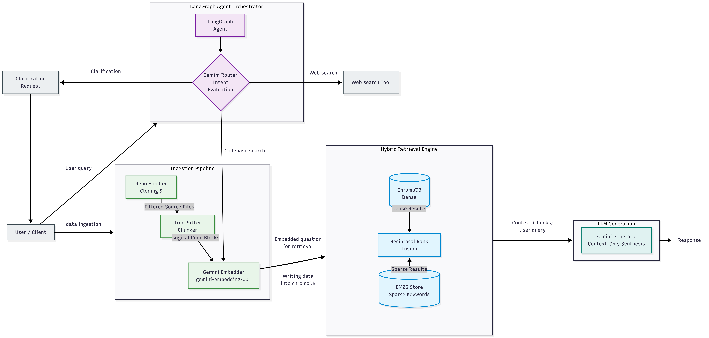

# Codebase Intelligence

Codebase Intelligence Backend built with FastAPI.

## Objective / Problem definition

Design and implement a backend service that:

- Accepts a GitHub repository URL.
- Clones and indexes the repository source code.
- Splits code into searchable chunks using Tree-sitter.
- Stores semantic embeddings in Chroma.
- Stores a sparse BM25 index for keyword based retrieval.
- Supports dense search, hybrid search, and answer generation over indexed code.
- Uses retrieved code chunks as context for Gemini based answers.
- Keeps source references with file paths and line numbers.

The system is built as a retrieval backend for understanding codebases. It combines vector search and BM25 search so developer questions can be answered from the actual repository content instead of relying only on model memory.

## Functional requirements

Repository indexing - the service accepts a GitHub repository URL, validates it, clones it, filters supported files, chunks the code, embeds the chunks, and stores the result.

Code chunking - Python, JavaScript, JSX, and Go files are parsed with Tree-sitter. Functions, classes, and methods are extracted as code chunks.

Dense retrieval - user questions are embedded with Gemini and searched against Chroma using cosine distance.

Sparse retrieval - code chunks are indexed with BM25 and queried using lowercase whitespace tokenization.

Hybrid retrieval - dense search results and BM25 results are combined using Reciprocal Rank Fusion.

Answer generation - retrieved chunks are passed to Gemini to generate an answer. The answer is instructed to use only the given chunks and cite file paths with line numbers.

Agent based question handling - LangGraph routes a question to codebase search or clarification or web search tool (future scope) before generating the final answer.

Health check - the API exposes a health endpoint to verify that the service is running.

## Non-Functional requirements

Scalability - indexing and querying are split into separate modules, and code chunking uses concurrent file processing.

Performance - low latency code retrieval is handled through Chroma vector search and BM25 lookup.

Consistency Model - indexed data is eventually available after repository indexing completes. A repository should be indexed before it is queried.

Security - repository URLs are validated to allow GitHub URLs only. Gemini API access is configured through environment variables.

Extensibility - new languages, chunking rules, retrieval strategies, and API routes can be added through the existing module structure.

## System design



## Project structure

```text
.
|-- main.py                 # FastAPI app and API endpoints
|-- app/
|   |-- agent.py            # LangGraph router and search flow
|   |-- bm25_store.py       # BM25 index save, load, and query logic
|   |-- chunker.py          # Tree-sitter based code chunking
|   |-- embedder.py         # Gemini embedding calls
|   |-- generator.py        # Gemini answer generation
|   |-- repo_handler.py     # GitHub clone and file filtering
|   `-- vector_store.py     # Chroma storage and vector query logic
|-- requirements.txt
|-- bm25_db/
|-- chroma_db/
`-- readme_image/
```

This project is under active development.

## Setup

Create a virtual environment:

```bash
python -m venv .venv
```

Activate it:

```bash
source .venv/bin/activate
```

On Windows PowerShell:

```powershell
.\.venv\Scripts\Activate.ps1
```

Install dependencies:

```bash
pip install -r requirements.txt
```

The code uses `google.genai`, so install the Google GenAI SDK if it is not already available:

```bash
pip install google-genai
```

Create a `.env` file:

```env
GEMINI_API_KEY=your_api_key_here
```

## Run the API

Start the FastAPI server:

```bash
uvicorn main:app --reload
```

If `uvicorn` is not installed:

```bash
pip install uvicorn
```

Service:

```text
API: http://localhost:8000
```

## API endpoints

Health check:

```http
GET /health
```

Index a repository:

```http
POST /index
```

```json
{
  "repo_url": "https://github.com/owner/repo"
}
```

Dense code search:

```http
POST /query
```

```json
{
  "repo_url": "https://github.com/owner/repo",
  "question": "Where is authentication handled?",
  "n_results": 5
}
```

Hybrid code search:

```http
POST /query/hybrid
```

```json
{
  "repo_url": "https://github.com/owner/repo",
  "question": "How is the vector store queried?",
  "n_results": 5
}
```

Ask a question:

```http
POST /ask
```

```json
{
  "repo_url": "https://github.com/owner/repo",
  "question": "How does indexing work?",
  "n_results": 5
}
```

Agent ask:

```http
POST /agent/ask
```

```json
{
  "repo_url": "https://github.com/owner/repo",
  "question": "Explain the retrieval flow",
  "n_results": 5
}
```

## Supported files

The repository filter accepts:

```text
.py, .js, .ts, .go, .java, .cpp, .c, .h, .cs, .rb, .rs, .php,
.swift, .kt, .scala, .jsx, .tsx, .vue, .mod, .sum
```

Tree-sitter chunking is currently implemented for:

```text
.py, .js, .jsx, .go
```

Files with other accepted extensions can pass filtering, but they are skipped during chunking unless language support is added in `app/chunker.py`.

## Storage

Chroma and BM25 runtime data are stored under:

```text
~/codebase-intelligence/chroma_db
~/codebase-intelligence/bm25_db
```

Cloned repositories are cached under:

```text
/tmp/codebase-intelligence
```

## Notes

- A repository must be indexed before query or ask endpoints can return useful results.
- Repository names are derived from GitHub URLs by replacing `/` with `_`.
- Large function or class chunks are split into 50-line chunks.
- BM25 tokenization is simple lowercase whitespace splitting.
- The router prompt includes a `web_search` option, but the current graph routes non-clarification decisions through codebase search.
